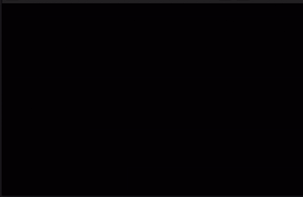
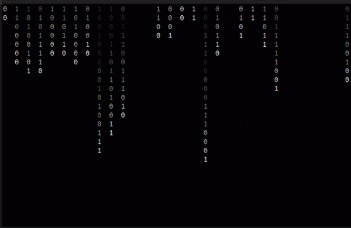
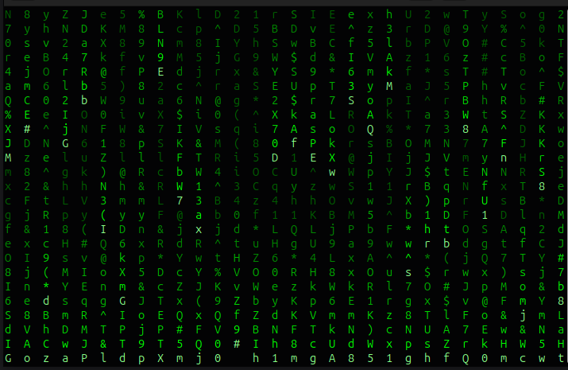
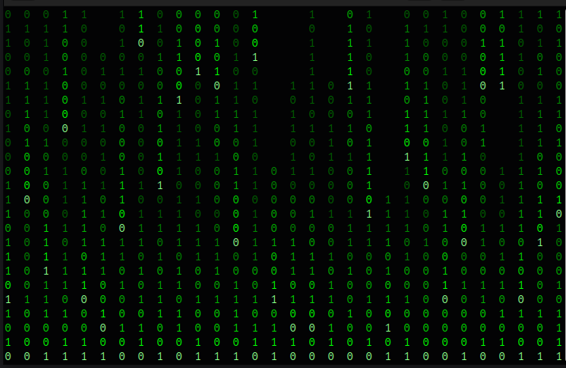
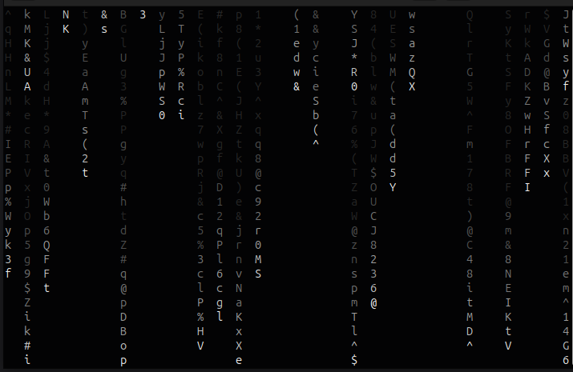
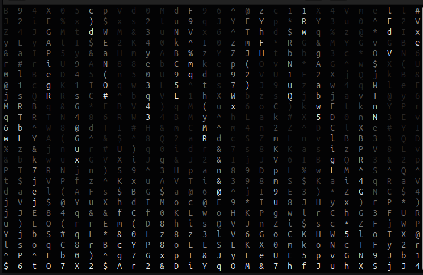
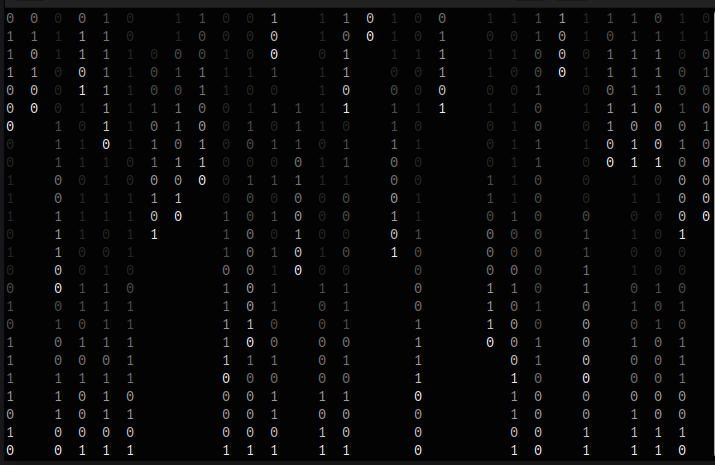
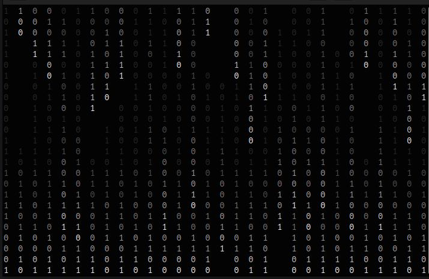
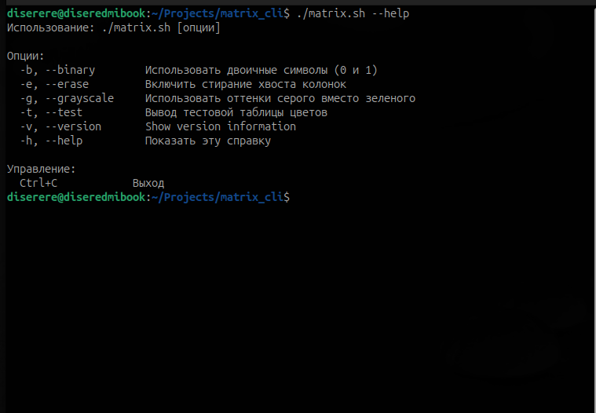

Matrix Console Animation
---
Bash-скрипт, имитирующий визуализацию из фильма "Матрица" прямо в терминале.



## Особенности

- **Два цветовых режима**: классический зелёный и градиент серого
- **Режимы символов**: полный набор символов или двоичный (только 0 и 1)
- **Эффект стирания**: опциональное стирание хвостов колонок
- **Адаптивный размер**: автоматически подстраивается под размер терминала

## Установка

```bash
# Скачать актуальную версию скрипта
curl -O https://raw.githubusercontent.com/diserere/matrix_cli/refs/heads/master/matrix.sh

# Сделать скрипт исполняемым
chmod +x matrix.sh

# Запустить
./matrix.sh
```

## Использование

```bash
# Базовый запуск (зелёный Matrix)
./matrix.sh

# Двоичный Matrix (только 0 и 1)
./matrix.sh --binary

# Серый Matrix со стиранием хвостов
./matrix.sh --grayscale --erase

# Тест цветовой палитры
./matrix.sh --test
./matrix.sh --grayscale --test
./matrix.sh --test --grayscale

# Показать справку
./matrix.sh --help
```

### Параметры командной строки

| Параметр | Короткая версия | Описание |
|----------|----------------|----------|
| `--binary` | `-b` | Использовать только символы 0 и 1 |
| `--erase` | `-e` | Включить стирание хвостов колонок |
| `--grayscale` | `-g` | Использовать оттенки серого вместо зелёного |
| `--test` | `-t` | Показать тестовую таблицу цветов и выйти |
| `--help` | `-h` | Показать справку по использованию |

## Управление

- **Ctrl+C** - Выход из программы

## Цветовые схемы

### 1. Зелёная тема (по умолчанию)
Градиент от ярко-зелёного к тёмно-зелёному, максимально приближенный к оригинальной заставке из фильма.

### 2. Серо-белая тема
Альтернативный вариант с градиентом от белого к тёмно-серому.

## Технические детали

- **Язык**: Bash 4.0+
- **Зависимости**: `tput` (обычно входит в состав `ncurses`)
- **Поддержка терминалов**: Все терминалы с поддержкой 256 цветов
- **Размер**: Адаптивный, подстраивается под текущий размер окна терминала

## Совместимость

Протестировано на:
- Ubuntu/Debian (bash 5.0+)
<!-- - macOS (bash 3.2+ с установленным `coreutils`)
- Windows WSL/WSL2
- Termux (Android) -->

## Примеры использования

```bash
# Классический Matrix
./matrix.sh

# Двоичный дождь с эффектом стирания
./matrix.sh -b -e

# Минималистичный серый вариант
./matrix.sh -g

# Проверить доступные цвета перед использованием
./matrix.sh -t
```

## Скриншоты

### Классический зелёный режим


### Двоичный режим (0 и 1), grayscale



### Сравнение режимов
<div align="center">
  <table>
    <tr>
      <td align="center"><br>matrix.sh</td>
      <td align="center"><br>matrix.sh -b</td>
    </tr>
    <tr>
      <td align="center"><br>matrix.sh -g -e</td>
      <td align="center"><br>matrix.sh -g</td>
    </tr>
    <tr>
      <td align="center"><br>matrix.sh -g -b -e</td>
      <td align="center"><br>matrix.sh -g -b</td>
    </tr>
    <tr>
      <td align="center"><br>matrix.sh --test</td>
      <td align="center"><br>matrix.sh --help</td>
    </tr>
  </table>
</div>


## Лицензия

MIT License. Смотрите файл LICENSE для подробностей.

## Вклад в проект

Приветствуются пул-реквесты и сообщения о проблемах!

1. Форкните репозиторий
2. Создайте ветку для новой функции (`git checkout -b feature/amazing-feature`)
3. Зафиксируйте изменения (`git commit -m 'Add amazing feature'`)
4. Запушьте в ветку (`git push origin feature/amazing-feature`)
5. Откройте пул-реквест

## Благодарности

- Братьям Вачовски за вдохновение
- Сообществу Linux за прекрасные инструменты
- Всем тестерам и контрибьюторам

---

**Примечание**: Для лучшего опыта рекомендуется использовать терминал с поддержкой 256 цветов.