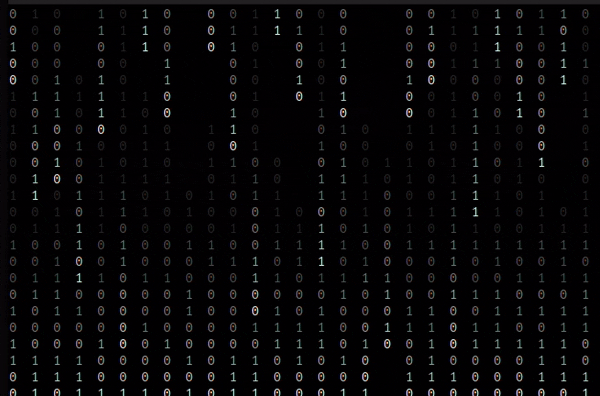
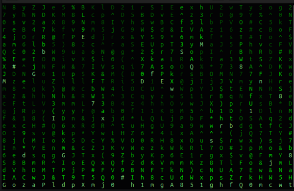
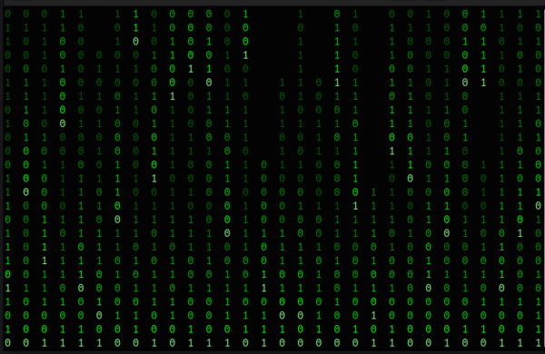
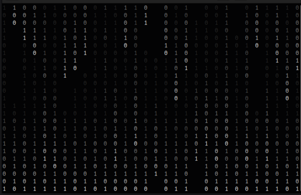
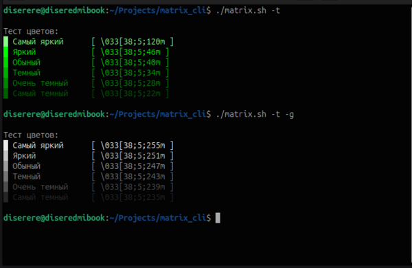
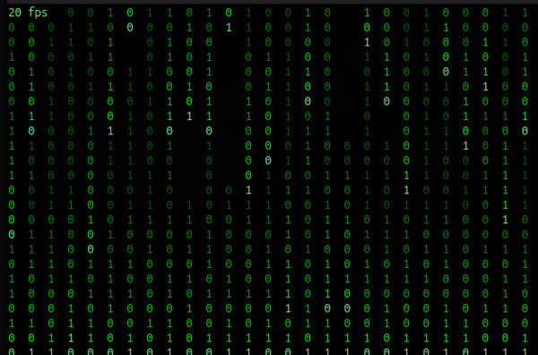
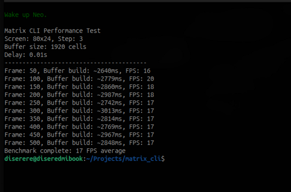
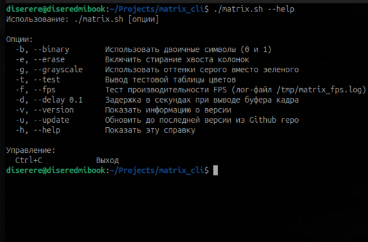
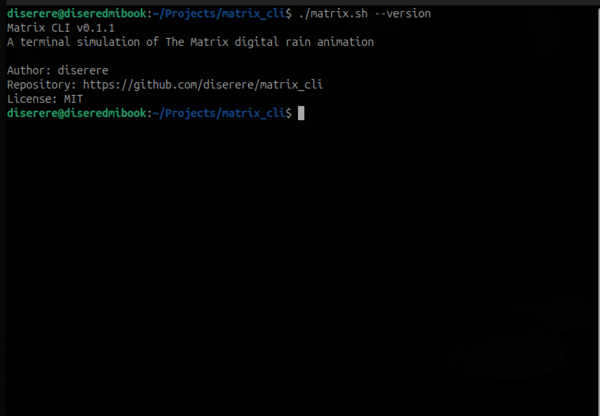
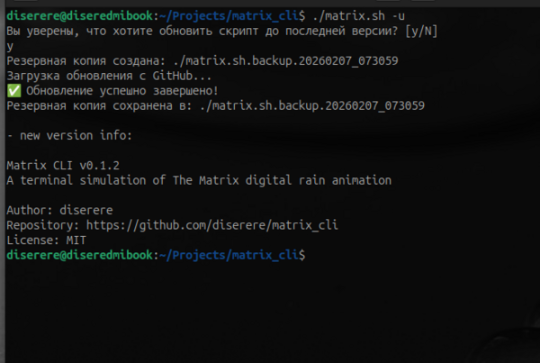

Matrix Console Animation
---
Bash-скрипт, имитирующий визуализацию из фильма "Матрица" в терминале.

[](https://github.com/diserere/matrix_cli/releases)


## Особенности

- **Два цветовых режима**: классический зелёный и градиент серого
- **Режимы символов**: полный набор символов или двоичный (только 0 и 1)
- **Эффект стирания**: опциональное стирание хвостов колонок
- **Адаптивный размер**: автоматически подстраивается под размер терминала

## Установка

```bash
# Скачать актуальную версию скрипта
curl -O https://raw.githubusercontent.com/diserere/matrix_cli/refs/heads/master/matrix.sh

# Сделать скрипт исполняемым
chmod +x matrix.sh

# Запустить
./matrix.sh
```

> [!TIP]
> Для лучшего опыта рекомендуется использовать терминал с поддержкой 256 цветов.

## Примеры использования

```bash
# Базовый запуск (зелёный Matrix)
./matrix.sh

# Двоичный Matrix (только 0 и 1)
./matrix.sh --binary

# Серый Matrix со стиранием хвостов
./matrix.sh --grayscale --erase

# Тест цветовой палитры
./matrix.sh --test
./matrix.sh --grayscale --test
./matrix.sh --test --grayscale

# Тест FPS для конкретного режима
./matrix.sh --fps --grayscale --binary --delay 0.05

# Показать справку
./matrix.sh --help

# Показать информацию о версии
./matrix.sh --version

# Обновить до последней версии из Github repo
./matrix.sh --update
```

## Параметры командной строки

| Параметр | Короткая версия | Описание |
|----------|----------------|----------|
| `--binary` | `-b` | Использовать только символы 0 и 1 |
| `--erase` | `-e` | Включить стирание хвостов колонок |
| `--grayscale` | `-g` | Использовать оттенки серого вместо зелёного |
| `--test` | `-t` | Показать тестовую таблицу цветов и выйти |
| `--fps` | `-f` | Тест производительности FPS |
| `--delay 0.1` | `-d 0.1` | Задержка в секундах при выводе буфера кадра |
| `--help` | `-h` | Показать справку по использованию |
| `--version` | `-v` | Показать информацию о версии |
| `--update` | `-u` | Обновить до последней версии из Github repo |

## Управление

- **Ctrl+C** - Выход из программы

## Цветовые схемы

### 1. Зелёная тема (по умолчанию)
Градиент от ярко-зелёного к тёмно-зелёному, максимально приближенный к оригинальной заставке из фильма.

### 2. Серо-белая тема
Альтернативный вариант с градиентом от белого к тёмно-серому.

## Технические детали

- **Язык**: Bash 4.0+
- **Зависимости**: `tput` (обычно входит в состав `ncurses`)
- **Поддержка терминалов**: Все терминалы с поддержкой 256 цветов
- **Размер**: Адаптивный, подстраивается под текущий размер окна терминала

## Совместимость

Протестировано на:
- Ubuntu/Debian (bash 5.0+)
- macOS (bash 3.2+ с установленным `coreutils`)
- Termux (Android)
> [!NOTE]
> Запуск в Termux требует установки пакета `ncurses-utils` из-за зависимости от `tput`:
> ```
> pkg update && pkg upgrade && pkg install ncurses-utils
> ``` 
<!-- - Windows WSL/WSL2 -->


## Производительность

> [!TIP]
> Используйте `--delay` для уменьшения скорости анимации на маленьких экранах:
> ```bash
> # Для терминала 80х24
> ./matrix.sh --delay 0.2
> ```

| Разрешение | FPS (без задержки) | Рекомендуемая задержка |
|------------|-------------------|------------------------|
| 80×24 (стандарт) | ~25 | 0.1-0.3s |
| 120×40 | ~12 | 0.05-0.2s |
| 238×65 (FullHD) | ~5 | no delay |


## Скриншоты

### Классический зелёный режим


### Двоичный режим (0 и 1), grayscale



### Примеры режимов
- `matrix.sh`



- `matrix.sh --binary --erase`



- `matrix.sh --grayscale`


- `matrix.sh --grayscale --binary --erase`



- `matrix.sh --test`



- `matrix.sh --fps --b -e -d 0.01`





- `matrix.sh --help`



- `matrix.sh --version`



- `matrix.sh --update`




## Лицензия

MIT License. Смотрите файл LICENSE для подробностей.

## Вклад в проект

Приветствуются пул-реквесты и сообщения о проблемах!

1. Форкните репозиторий
2. Создайте ветку для новой функции (`git checkout -b feature/amazing-feature`)
3. Зафиксируйте изменения (`git commit -m 'Add amazing feature'`)
4. Запушьте в ветку (`git push origin feature/amazing-feature`)
5. Откройте пул-реквест

## Благодарности

- Братьям Вачовски за вдохновение
- Сообществу Linux за прекрасные инструменты
- Большой языковой модели DEEPSEEK за помощь и консультации
- Всем тестерам и контрибьюторам

## Список изменений

[CHANGELOG.md](CHANGELOG.md) - подробная информация об в каждой версии.
